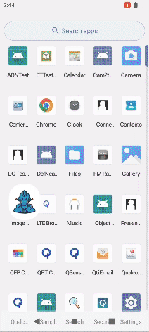

# Table of Contents
- [Table of Contents](#table-of-contents)
- [Introduction](#introduction)
    + [About "Image Super Resolution"](#about--image-super-resolution-)
    + [Pre-Requisites](#pre-requisites)
- [Model Selection and DLC conversion](#model-selection-and-dlc-conversion)
    + [Model Overview](#model-overview)
    + [Steps to convert model to DLC](#steps-to-convert-model-to-dlc)
- [Source Overview](#source-overview)
    + [Source Organization](#source-organization)
    + [Code Implementation](#code-implementation)
- [Build APK file with Android Studio](#build-apk-file-with-android-studio)
- [Results](#results)
# Introduction

### About "Image Super Resolution" 

- Current project is an sample Android application for AI-based Image Super Resolution using [Qualcomm® Neural Processing SDK for AI](https://developer.qualcomm.com/sites/default/files/docs/snpe/index.html) framework. 
- We have used 5 Models in this Solution
- This sample enhances input image resolution by 4x along width, and height. If input resolution is wxh, output resolution will be 4*w x 4*h
- DLC models take only fixed input size.
- If users intend to use a different model in this demo framework, **image pre/post processing will be needed**. 
- Current pre/post processing is specific to the models used. 

### Pre-Requisites 

- Qualcomm® Neural Processing SDK for AI setup should be completed by following the guide here : https://developer.qualcomm.com/sites/default/files/docs/snpe/setup.html
- Android Studio to import sample project
- Android NDK to build native code
- Install opencv using ```pip install opencv-python```

# Model Selection and DLC conversion

### Model Overview

Please refer to Models repository for model overview
<TODO> Add public link

### Steps to convert model to DLC
Please refer to Models repository for model overview
<TODO> Add public link

# Source Overview

### Source Organization

- <DIR> demo: Contains demo video, GIF 
- <DIR> superresolution: Contains source files in standard Android app format.
- app\src\main\assets : Contains Model binary DLC
- superresolution\src\main\java\com\qcom\imagesuperres : Application java source code
- superresolution\src\main\cpp : Application C++(native) source code
- sdk : Contains openCV sdk (Will be generated using _ResolveDependencies.sh_ )
   
### Code Implementation

- Model Initialization
   
   `public boolean loadingMODELS(char runtime_var, String dlc_name)`
  - runtime_var: Possible options are D, G, C. 
  - dlc_name: Name of the DLC.
  
- Running Model
 
  - Following is the Java Function, that handles model execution. This function iternally calls sub functions to handle pre-processing and post-processing
     
      `inferSNPE(inputMat.getNativeObjAddr(), outputMat.getNativeObjAddr())`
       - inputMat is opencv Matrix that contains input image.
       - outputMat is the destination for the output image

   - C++ function that handles preprocessing for the input image.
   
       `preprocess(std::vector<float32_t> &dest_buffer, cv::Mat &img, std::vector<int> dims) `
  
   - C++ function that handles postprocessing after we receive input from model
      
       `postprocess(cv::Mat &outputimg)`
   
   - SNPE API function that runs the network and give result 

       `snpe->execute(inputMap, outputMap);`


# Build APK file with Android Studio  
   
1. Clone this repo.
2. Generate DLC using the steps mentioned.
3. Run below script, from the directory where it is present, to resolve dependencies of this project.
   
	`bash resolveDependencies.sh`
 
   * This script will download opencv and paste to sdk directory, to enable OpenCv for android Java.
   * This script will copy snpe-release.aar file from $SNPE_ROOT to "snpe-release" directory in Android project.

	**NOTE - If you are using SNPE version 2.11 or greater, please change following line in resolveDependencies.sh.**
   ```
	From: cp $SNPE_ROOT/android/snpe-release.aar snpe-release
	To : cp $SNPE_ROOT/lib/android/snpe-release.aar snpe-release
	```

4. Import folder VisionSolution2-ImageSuperResolution as a project in Android Studio 
5. Do gradle sync
6. Compile the project. 
7. Output APK file should get generated : superresolution-debug.apk
8. Prepare the Qualcomm Innovators development kit(QIDK) to install the application (Do not run APK on emulator)
9. Install and test application : superresolution-debug.apk

```java
adb install -r -t superresolution-debug.apk
```

10. launch the application

Following is the basic "Image Super Resolution" Android App 

1. Select one of the models
2. Select one of the given images from the drop-down list
3. Select the run-time to run the model (CPU, GPU or DSP)
4. Observe the result of model on screen
5. Also note the performance indicator for the particular run-time in mSec

Same results for the application are shown below 

# Results

- Demo video, and performance details as seen below:
	



###### *Qualcomm Neural Processing SDK and Snapdragon are products of Qualcomm Technologies, Inc. and/or its subsidiaries. AIMET Model Zoo is a product of Qualcomm Innovation Center, Inc.*
